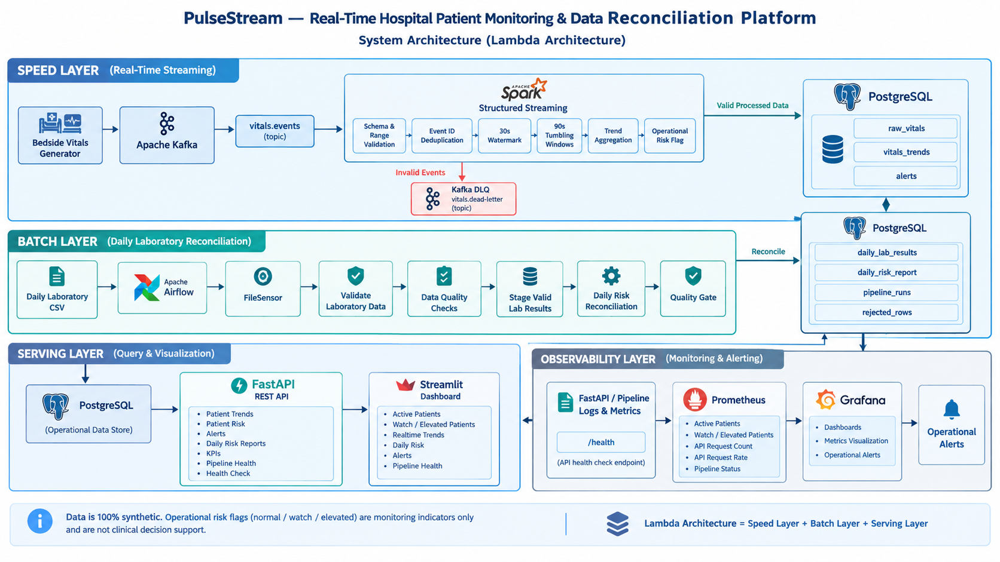
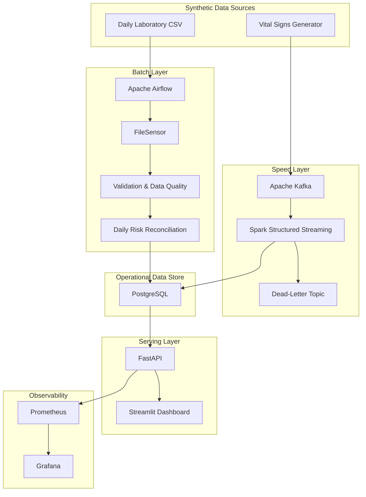

# PulseStream

### Real-Time Hospital Patient Monitoring & Data Reconciliation Platform

PulseStream is an end-to-end **data engineering platform** that demonstrates how real-time patient vital-sign events and scheduled laboratory data can be processed, reconciled, stored, served, and monitored using a **Lambda Architecture**.

The platform combines **Apache Kafka, Apache Spark Structured Streaming, Apache Airflow, PostgreSQL, FastAPI, Streamlit, Prometheus, and Grafana** into a complete data pipeline.

> **Disclaimer:** PulseStream uses 100% synthetic data. Risk indicators such as `normal`, `watch`, and `elevated` are operational demonstration indicators only and must not be interpreted as medical diagnosis or clinical decision support.

---

## Overview

Modern hospital environments generate multiple types of data at different frequencies. Vital-sign measurements may arrive continuously from monitoring devices, while laboratory results may arrive as scheduled batch files.

PulseStream demonstrates how these workloads can be handled through separate **streaming and batch processing paths** while maintaining a shared operational data store.

### Business Question

> **Which patients are currently showing concerning vital-sign trends, and how do laboratory results affect the daily operational risk picture?**

### Key Capabilities

* Real-time vital-sign ingestion
* Event validation and dead-letter handling
* Duplicate event detection
* Event-time processing and watermarking
* Window-based stream aggregation
* Operational risk classification
* Daily laboratory reconciliation
* Data-quality validation
* Idempotent database writes
* REST API serving
* Operational monitoring dashboard
* Prometheus metrics
* Grafana dashboards and alerts
* Failure and recovery testing
* Automated testing with pytest

---

## System Architecture

PulseStream follows a **Lambda Architecture** combining real-time stream processing with batch laboratory-data reconciliation.



### Architecture Layers

- **Speed Layer** — Processes real-time patient vital-sign events using Apache Kafka and Spark Structured Streaming.
- **Batch Layer** — Processes daily laboratory CSV data using Apache Airflow and performs reconciliation with real-time vital trends.
- **Serving Layer** — Uses PostgreSQL as the central operational data store, with FastAPI providing REST APIs and Streamlit providing the dashboard.
- **Observability Layer** — Monitors API and pipeline health using Prometheus and Grafana.

> **Note:** Data is 100% synthetic. Operational risk flags (normal / watch / elevated) are monitoring indicators only and are not clinical decision support.




---

## Data Flow

### Real-Time Streaming Pipeline

```text
Synthetic Vital Events
        │
        ▼
Apache Kafka
vitals.events
        │
        ▼
Spark Structured Streaming
        │
        ├── Schema Validation
        ├── Deduplication
        ├── Event-Time Processing
        ├── 30s Watermark
        ├── 90s Tumbling Windows
        ├── Trend Aggregation
        └── Risk Classification
                │
                ▼
           PostgreSQL
```

Invalid events are routed to:

```text
vitals.dead-letter
```

### Batch Reconciliation Pipeline

```text
Daily Laboratory CSV
        │
        ▼
Apache Airflow
        │
        ▼
FileSensor
        │
        ▼
Validation & Data Quality
        │
        ├── Valid Records
        │
        └── Rejected Records
                │
                ▼
       Daily Reconciliation
                │
                ▼
           PostgreSQL
```

### Serving & Monitoring

```text
                  PostgreSQL
                       │
                       ▼
                    FastAPI
                   /       \
                  ▼         ▼
            REST API     Metrics
                │            │
                ▼            ▼
           Streamlit      Prometheus
           Dashboard          │
                              ▼
                           Grafana
```

---

# Technology Stack

| Technology     | Version | Purpose                         |
| -------------- | ------: | ------------------------------- |
| Apache Kafka   |   4.0.1 | Real-time event ingestion       |
| Apache Spark   |   4.2.0 | Structured stream processing    |
| Apache Airflow |   3.1.0 | Batch orchestration             |
| PostgreSQL     |      16 | Operational data storage        |
| FastAPI        |       — | REST API                        |
| Streamlit      |       — | Operational dashboard           |
| Prometheus     |       — | Metrics collection              |
| Grafana        |  12.1.1 | Monitoring and alerting         |
| Docker Compose |       — | Infrastructure management       |
| Python         |       — | Application and data generation |
| pytest         |       — | Automated testing               |

---

# Project Structure

```text
pulsestream/
│
├── airflow/
│   └── dags/
│       └── pulsestream_daily_reconciliation.py
│
├── api/
│   ├── __init__.py
│   ├── database.py
│   └── main.py
│
├── dashboard/
│   └── app.py
│
├── data/
│   ├── incoming/
│   └── processed/
│
├── database/
│   └── schema.sql
│
├── kafka/
│
├── monitoring/
│   └── prometheus/
│       └── prometheus.yml
│
├── producers/
│   ├── producer.py
│   ├── vitals_generator.py
│   ├── patient_generator.py
│   ├── lab_generator.py
│   ├── abnormality.py
│   ├── corruption.py
│   ├── duplicates.py
│   ├── sensor_dropout.py
│   └── ...
│
├── shared/
│   └── ...
│
├── spark/
│   └── kafka_stream.py
│
├── tests/
│   └── ...
│
├── docker-compose.yml
├── requirements.txt
├── .env.example
└── README.md
```

---

# Streaming Pipeline

## Event Schema

Vital-sign events contain fields such as:

```text
patient_id
event_id
heart_rate
spo2
systolic_bp
diastolic_bp
temperature
timestamp
```

Events are published to:

```text
vitals.events
```

---

## Validation

Incoming events are validated against the expected schema and measurement constraints.

Invalid events are redirected to the dead-letter topic:

```text
vitals.dead-letter
```

This prevents malformed records from entering the operational data store.

---

## Deduplication

Each event contains a unique `event_id`.

The pipeline uses this identifier to prevent duplicate events from being persisted.

This supports reliable processing in scenarios involving:

* Producer retries
* Duplicate messages
* Simulated sensor duplication
* Event replay

---

## Event-Time Processing

The streaming pipeline uses a:

```text
30-second watermark
```

to tolerate late-arriving events while processing records according to their event timestamps.

---

## Window Aggregation

Patient measurements are grouped into:

```text
90-second tumbling windows
```

The pipeline calculates:

* Average heart rate
* Average SpO2
* Average temperature
* Number of abnormal events

---

## Operational Risk Classification

The prototype applies a simple rule-based operational indicator:

| Abnormal Events | Indicator  |
| --------------: | ---------- |
|               0 | `normal`   |
|               1 | `watch`    |
|              2+ | `elevated` |

These values are intended solely for demonstrating data processing and monitoring workflows.

---

# Batch Processing

Laboratory results are generated as daily CSV files.

Example fields:

```text
patient_id
test_type
result_value
reference_range
collected_at
sim_date
```

Airflow orchestrates the batch workflow using a `FileSensor`.

### Processing Steps

```text
1. Detect laboratory file
2. Validate input
3. Run data-quality checks
4. Stage valid records
5. Track rejected rows
6. Reconcile daily patient risk
7. Apply quality gate
8. Record pipeline execution status
```

Pipeline execution information is stored in:

```text
pipeline_runs
```

---

# Data Storage

PostgreSQL acts as the shared operational data store.

### Core Tables

```text
patients
raw_vitals
vitals_trends
daily_lab_results
rejected_rows
daily_risk_report
alerts
pipeline_runs
```

### Idempotency

The system uses database constraints and conflict-safe writes to support idempotent processing.

Examples include:

* `event_id` primary key for raw vital events
* Unique patient/window constraints for trends
* Unique alert constraints for duplicate prevention

---

# REST API

FastAPI exposes processed operational data through REST endpoints.

## Health

```http
GET /health
```

Example:

```json
{
  "status": "healthy",
  "service": "pulsestream-api"
}
```

## Operational KPIs

```http
GET /kpis
```

Example:

```json
{
  "active_patients": 20,
  "watch_or_elevated_patients": 2,
  "risk_percentage": 10.0,
  "active_alerts": 12
}
```

## Available Endpoints

| Endpoint                            | Purpose                   |
| ----------------------------------- | ------------------------- |
| `GET /health`                       | API health check          |
| `GET /kpis`                         | Operational KPIs          |
| `GET /daily-risk`                   | Daily risk report         |
| `GET /patients/{patient_id}/trends` | Patient vital trends      |
| `GET /patients/{patient_id}/risk`   | Patient risk information  |
| `GET /alerts`                       | Operational alerts        |
| `GET /pipeline-health`              | Pipeline execution health |
| `GET /metrics`                      | Prometheus metrics        |

---

# Dashboard

The Streamlit dashboard provides an operational view of the platform.

### Dashboard Components

* Active patient count
* Watch/elevated patient count
* Risk percentage
* Active alerts
* Patient risk overview
* Realtime patient trends
* Pipeline health
* Daily reconciliation results
* Recent pipeline runs
* Operational alerts

---

# Observability

PulseStream exposes application metrics through Prometheus.

```http
GET /metrics
```

### Metrics

```text
pulsestream_api_requests_total
pulsestream_active_patients
pulsestream_watch_or_elevated_patients
```

Prometheus is configured with a:

```text
5-second scrape interval
```

### Grafana

Grafana provides dashboards for:

* Active Patients
* API Requests
* API Request Rate
* Watch / Elevated Patients

### Operational Alert

A Grafana-managed alert is configured for:

```text
pulsestream_watch_or_elevated_patients > 0
```

---

# Testing

The project includes automated tests using `pytest`.

### Current Result

```text
36 passed
```

### Test Coverage Areas

* Kafka ingestion
* Event validation
* Invalid event handling
* Dead-letter routing
* Duplicate handling
* Window aggregation
* Risk classification
* PostgreSQL persistence
* Batch validation
* Idempotency
* API health
* Pipeline health

Run the test suite:

```bash
python -m pytest -q
```

---

# Reliability Testing

PulseStream was also tested under controlled component failures.

## Kafka Recovery

Kafka was stopped while events were being produced.

```text
Kafka Running
      │
      ▼
Event Production
      │
      ▼
Kafka Stopped
      │
      ▼
Connection Failure
      │
      ▼
Kafka Restarted
      │
      ▼
Event Production Resumes
```

## PostgreSQL Recovery

PostgreSQL was stopped to verify database failure handling.

After PostgreSQL was restarted, the application successfully reconnected.

## Spark Recovery

The Spark streaming application was stopped and restarted using its existing checkpoint location.

The streaming application restored its state and continued processing new events.

---

# Verified Results

## Streaming

```text
Events generated:    201
Accepted raw rows:   196
```

## Batch

```text
Laboratory records:   81
Valid records:         75
Rejected records:       6
```

## Automated Tests

```text
36 passed
```

## Current Operational KPIs

```text
Active patients:                  20
Watch / elevated patients:         2
Risk percentage:                 10.0%
Active alerts:                    12
```

---

# Docker Infrastructure

Docker Compose provides the core infrastructure:

```text
Apache Kafka
PostgreSQL
Prometheus
```

Grafana is containerized separately.

Application components such as Spark, Airflow, and Streamlit are currently executed in their respective host/WSL development environments.

Therefore, PulseStream does **not** claim that the entire application stack is deployed inside a single Docker Compose environment.

---

# Installation & Setup

## Prerequisites

Ensure the following are installed:

* Python
* Docker
* Docker Compose
* Java 21
* Apache Spark
* Hadoop/WinUtils where required by the Windows Spark environment

---

## 1. Clone the Repository

```bash
git clone <repository-url>
cd pulsestream
```

---

## 2. Configure Environment Variables

Create a `.env` file based on `.env.example`.

Example:

```env
POSTGRES_USER=pulsestream
POSTGRES_PASSWORD=changeme
POSTGRES_DB=pulsestream

KAFKA_BOOTSTRAP_SERVERS=kafka:9092
KAFKA_TOPIC_VITALS=vitals.events
KAFKA_TOPIC_DLQ=vitals.dead-letter

SIM_DAY_SECONDS=300
PRODUCER_PATIENT_COUNT=20
PRODUCER_SEED=42

API_PORT=8000

GRAFANA_ADMIN_PASSWORD=changeme
```

> Never commit production credentials or secrets to the repository.

---

# Running the Platform

## 1. Start Infrastructure

```bash
docker compose up -d
```

Check running services:

```bash
docker compose ps
```

Expected services:

```text
pulsestream-kafka
pulsestream-postgres
pulsestream-prometheus
```

---

## 2. Start FastAPI

From the project root:

```bash
uvicorn api.main:app --reload --port 8000
```

Health check:

```text
http://localhost:8000/health
```

---

## 3. Start Streamlit

```bash
streamlit run dashboard/app.py
```

---

## 4. Configure Spark

On Windows:

```cmd
set JAVA_HOME=C:\Program Files\Eclipse Adoptium\jdk-21.0.12.101-hotspot
set HADOOP_HOME=C:\hadoop
set PATH=%HADOOP_HOME%\bin;%JAVA_HOME%\bin;%PATH%
```

Start the streaming application:

```bash
spark-submit --packages org.apache.spark:spark-sql-kafka-0-10_2.13:4.2.0 spark\kafka_stream.py
```

---

## 5. Start the Producer

```bash
python producers/producer.py
```

The producer generates synthetic patient events and publishes them to Kafka.

---

## 6. Run Tests

```bash
python -m pytest -q
```

---

# End-to-End Workflow

```text
                         Synthetic Data
                              │
                ┌─────────────┴─────────────┐
                │                           │
                ▼                           ▼
        Vital Measurements            Daily Lab CSV
                │                           │
                ▼                           ▼
           Apache Kafka                Airflow
                │                           │
                ▼                           ▼
        Spark Streaming                FileSensor
                │                           │
                ▼                           ▼
        Stream Processing          Data Validation
                │                           │
                ▼                           ▼
        Realtime Trends          Daily Reconciliation
                │                           │
                └─────────────┬─────────────┘
                              │
                              ▼
                         PostgreSQL
                              │
                     ┌────────┴────────┐
                     │                 │
                     ▼                 ▼
                  FastAPI          Analytics
                     │
                     ▼
                Streamlit
                 Dashboard

                     │
                     ▼
                Prometheus
                     │
                     ▼
                  Grafana
```

---

# Engineering Concepts Demonstrated

PulseStream brings together several important data-engineering concepts.

### Streaming

* Kafka-based event ingestion
* Spark Structured Streaming
* Event-time processing
* Watermarking
* Window aggregation
* Dead-letter handling
* Deduplication

### Batch

* Airflow DAG orchestration
* FileSensor
* Batch validation
* Data-quality checks
* Reconciliation
* Quality gates

### Data Management

* PostgreSQL
* Database constraints
* Idempotent writes
* Operational data modeling

### Application Serving

* FastAPI
* REST APIs
* Operational KPIs

### Visualization

* Streamlit
* Realtime trend visualization
* Operational dashboards

### Observability

* Prometheus metrics
* Grafana dashboards
* Operational alerting

### Reliability

* Kafka failure recovery
* PostgreSQL failure recovery
* Spark checkpoint recovery

### Testing

* Automated pytest suite
* Integration-oriented validation
* Failure testing

---

# Scope & Limitations

PulseStream is an **academic data-engineering prototype** and intentionally operates within a simulated environment.

### Current Limitations

* 100% synthetic patient data
* Simulated hospital environment
* Simplified operational risk rules
* Local development infrastructure
* Limited authentication and authorization
* No production clinical validation
* No real patient information

The platform is **not intended for clinical use**.

A production implementation would require additional engineering around:

* Authentication and authorization
* Encryption
* Privacy and data governance
* Audit logging
* High availability
* Horizontal scalability
* Disaster recovery
* Secret management
* Regulatory compliance
* Clinical validation

---

# Future Improvements

Potential extensions include:

### Infrastructure

* Cloud deployment
* Kubernetes-based orchestration
* Distributed Spark deployment
* Fully containerized Airflow and Spark
* CI/CD automation

### Streaming

* Kafka consumer-lag monitoring
* Spark processing-latency metrics
* Advanced event-time processing
* Schema Registry integration

### Data Quality

* Automated data-quality dashboards
* Data lineage
* Advanced anomaly detection
* Great Expectations or equivalent validation framework

### Observability

* End-to-end pipeline tracing
* More detailed infrastructure metrics
* Alert routing integrations
* Centralized logging

### Security

* OAuth2 / JWT authentication
* Role-based access control
* Secret management
* TLS
* Audit logging

### Analytics

* Historical trend analysis
* Long-term operational analytics
* Patient-level historical reporting
* Advanced operational dashboards

---

# Academic Context

**Module:** EC8203 — Applied Big Data Engineering

**Project:** PulseStream — Real-Time Hospital Patient Monitoring & Data Reconciliation Platform

**Architecture:** Lambda Architecture

**Data:** 100% synthetic

**Primary Technologies:**

```text
Apache Kafka
Apache Spark Structured Streaming
Apache Airflow
PostgreSQL
FastAPI
Streamlit
Prometheus
Grafana
Docker Compose
Python
pytest
```

---

# Project Highlights

```text
┌─────────────────────────────────────────────────────────┐
│                       PULSESTREAM                       │
├─────────────────────────────────────────────────────────┤
│                                                         │
│  Real-Time Streaming       Batch Processing             │
│  ───────────────────       ────────────────             │
│  Kafka                     Airflow                      │
│  Spark                     FileSensor                   │
│  Watermarking              Data Quality                 │
│  Windowing                 Reconciliation               │
│                                                         │
│  Operational Serving       Observability                │
│  ───────────────────       ─────────────                │
│  PostgreSQL                Prometheus                   │
│  FastAPI                   Grafana                      │
│  Streamlit                 Alerts                       │
│                                                         │
│  Reliability & Testing                                   │
│  ───────────────────                                    │
│  Failure Recovery                                      │
│  Idempotency                                           │
│  36 Automated Tests                                    │
│                                                         │
└─────────────────────────────────────────────────────────┘
```

---

# Quick Start

```bash
# Start infrastructure
docker compose up -d

# Start API
uvicorn api.main:app --reload --port 8000

# Start Spark
spark-submit --packages org.apache.spark:spark-sql-kafka-0-10_2.13:4.2.0 spark\kafka_stream.py

# Start producer
python producers/producer.py

# Start dashboard
streamlit run dashboard/app.py

# Run tests
python -m pytest -q
```

---

## Summary

PulseStream demonstrates a complete data-engineering workflow for processing continuous and batch workloads through a Lambda Architecture.

The platform integrates:

**Kafka → Spark → PostgreSQL → FastAPI → Streamlit**

with:

**Airflow → Batch Reconciliation**

and:

**Prometheus → Grafana → Operational Monitoring**

The project focuses on practical data-engineering concepts including **real-time processing, batch orchestration, event-time semantics, data quality, idempotency, operational serving, observability, testing, and failure recovery**.

> **PulseStream is an academic prototype built entirely with synthetic data and is not intended for clinical or medical use.**

---

### EC8203 — Applied Big Data Engineering

**PulseStream — Real-Time Hospital Patient Monitoring & Data Reconciliation Platform**
